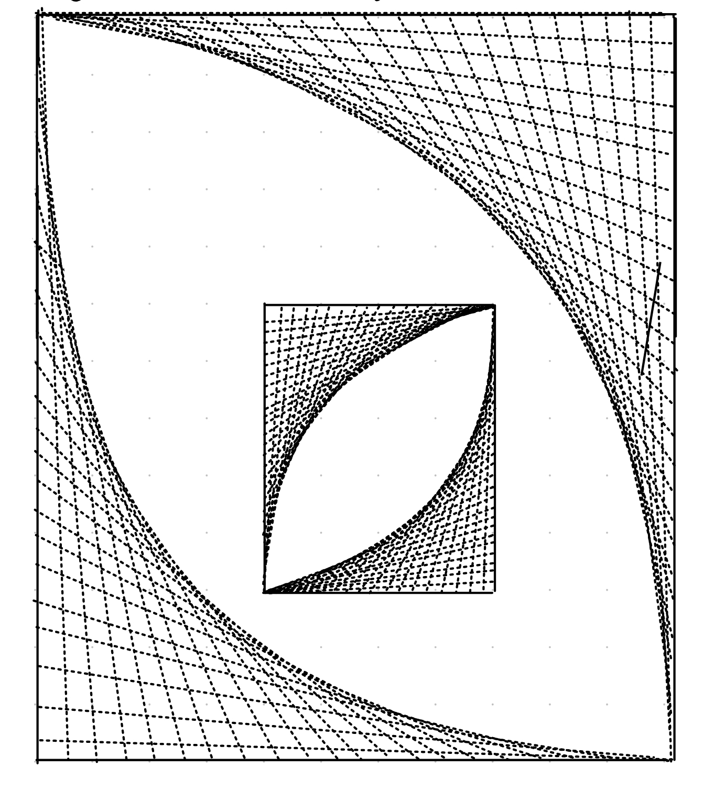

# String Art Generator

## Description

While getting bored in my class today I remembered this line art which my teacher ones taught me in school and start doodling on my tablet. I just thought it'd be interesting to see if I can write a program for it and hence this project. Here's what I came up with then:

